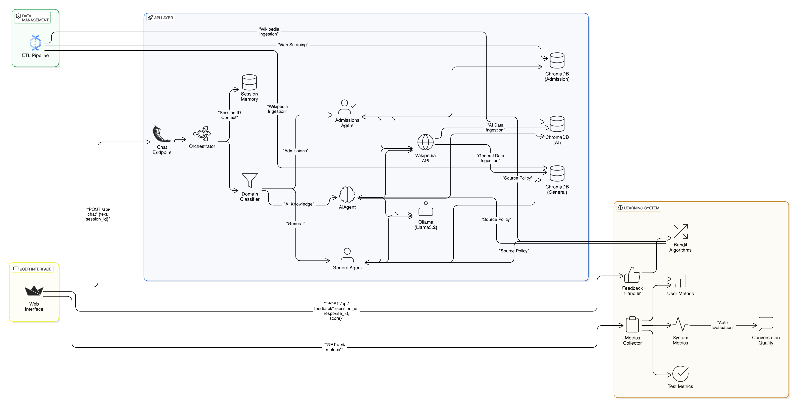

# An Adaptive Multi-Agent Chatbot System using Ollama

This project is a **context-aware, intelligent multi-agent chatbot system**. Leveraging the power of **Ollama**, **LangChain**, **vector embeddings**, and **reinforcement learning**, the chatbot supports dynamic, multi-turn conversations across several domains with memory retention and real-time adaptability.

---
## 🧾 Authors
- Sneh Patel (40264053)
- Romit Patel (40273551)
- Sahil Khunt (40279373)
- Rushi Donga (40269583)

---
## 🚀 Features
- 🤖 **3 Specialized Agents**
  | Agent         | Function                             | Knowledge Source            |
  |---------------|--------------------------------------|-----------------------------|
  | Admissions    | Concordia CS admissions info        | University web data         |
  | AI Knowledge  | Technical AI/ML concepts           | Wikipedia + Research data   |
  | General       | Broad domain queries                 | Wikipedia                   |

- 🔀 **Smart Routing System**
  - Context-aware query classification
  - Conversation history tracking
  - Domain-specific knowledge retrieval

- 🧠 **Context-Aware Memory**:  
  - Maintains memory of prior exchanges to ensure coherent and logical dialogue progression.

- 🌐 **External Knowledge Integration**:  
  - Utilizes APIs (e.g., Wikipedia) to supplement and fact-check responses.

- 🔁 **Multi-Turn Conversations**:  
  - Tracks dialogue state across sessions
  - Adapts responses to evolving user intent

- 🧠 **Vector Database + Embeddings**
  - Uses **ChromaDB** to store conversation chunks as vector embeddings
  - Enables **Retrieval-Augmented Generation (RAG)** for factual grounding

- 🤖 **Reinforcement Learning with Contextual Bandit**
  - User feedback (👍/👎/🤷) trains a contextual bandit model
  - Selects optimal agent/prompt strategies in real-time

- 📈 **Continuous Learning**
  - Real-time user feedback integration
  - Reinforcement learning from interactions
  - Automatic performance benchmarking

- 🎯 **Evaluation Criteria**:  
  - 📈 **Accuracy**: Factual correctness of responses
  - 🔗 **Coherence**: Logical flow consistency
  - 😊 **Satisfaction**: User-reported experience quality

- 📊 **Evaluation Metrics**:
   - **User Metrics**
      - Collected from explicit user feedback (👍/👎/🤷 ratings)
      - Measures: Immediate user satisfaction
            
   - **System Metrics**
      - Automated conversation quality assessment
      - Evaluates: Accuracy, Coherence, Context maintenance
            
   - **Test Metrics**
      - Benchmark results from predefined test cases
      - Simulates: Real-world usage scenarios

---

## 🛠 Tech Stack

| Component         | Technology             |
|------------------|------------------------|
| Language Model    | [Ollama](https://ollama.com) |
| Memory & Prompting| LangChain              |
| Vector Store       | ChromaDB + Embeddings     |
| RL Optimization    | Contextual Bandit (custom)|
| API Framework     | FastAPI                |
| UI                | Streamlit              |
| Language          | Python 3.10+           |

---

## 🏗️ System Architecture



**Core Flow:**  
The system processes user interactions, generates responses, and improves iteratively based on feedback:

1. **User Interaction**: Users interact with the system via a web interface.
2. **Request Handling**: Requests are sent to the API layer for processing.
3. **Domain Classification**: The orchestrator routes requests to the appropriate agent based on the domain.
4. **Knowledge Retrieval**: The system retrieves relevant information from ChromaDB using RAG principles.
5. **Response Generation**: Agents utilize retrieved knowledge and AI models to generate contextually relevant responses.
6. **Reinforcement Learning**: The system learns from user interactions through state-action-reward mechanisms.
7. **Feedback Processing**: User feedback is collected and processed through the feedback handler.
8. **System Optimization**: Bandit algorithms optimize agent selection and response quality based on collected metrics.
9. **Continuous Improvement**: Auto-evaluation measures conversation quality for iterative enhancement.

---

## ▶️ Getting Started
1. Clone the repository
   ```bash
   git clone git@github.com:snehpatel111/adaptive-multi-agent-chatbot.git
   cd adaptive-multi-agent-chatbot
   ```
2. Run the Docker Compose
   ```bash
   docker-compose up -d
   ```
3. You can now view your Streamlit app in your browser: http://localhost:8501
---

## ⚠️ First-Time Setup Notes

If you're running this project for the first time, please read the following carefully to avoid common startup errors:

### 🐘 1. Ollama & Model Download Delay

When you launch the project with `docker-compose up -d`, the following happens:

- Ollama will **automatically download** itself and then pull the `llama3.2` model.
- This model download can take **several minutes** depending on your internet speed.

#### ❗ Common Issue:
You might see an error like: `model "llama3.2" not found, try pulling it first`.
This happens because:
- The **API and UI containers** may start before Ollama finishes pulling the model.
- As a result, requests to the chatbot will fail until the model is ready.

#### ✅ Solution:
1. Run the following command to check the status:
   ```bash
   docker logs ollama-model-pull
   ```
   If you see:
   ```
   {"status":"success"}
   ```
   Then:
   ```
   docker-compose down
   docker-compose up -d
   ```
This will restart the containers with the model now available and properly registered.

### ⏳ 2. ETL Process May Delay API Start
Our backend performs a lightweight ETL (Extract, Transform, Load) routine during startup to:
- Preload vector embeddings
- Initialize knowledge bases

This process can some time, depending on your machine.

#### ❗ Common Issue:
When you open the Streamlit UI (http://localhost:8501), you might encounter a ConnectionError.

#### ✅ Solution:
Just wait ~1 minute and refresh the page. The API should finish initializing and the UI will function correctly.

#### ℹ️ Pro Tip: Use docker ps and docker logs to monitor container startup during the first run.

---

## 📹 Demo
🎥 **[Click here to watch the demo](https://drive.google.com/file/d/1bbRIzrVoAkCbgHt4g7MPRqQGu5yrUPKU/view?usp=sharing)**